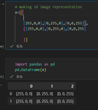
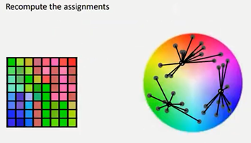

### What are features?

----------

Features are parts or patterns of an object in an image that help to identify it.\
For example — a square has 4 corners and 4 edges, they can be called features of the square, and they help us humans identify it’s a square. Features include properties like corners, edges, regions of interest points, ridges, etc.
As shown in the image below the yellow points show the features detected using a technique called Harris Detection.  
 
 
 

### What is Image Segmentation?
----------

- It is a transition from Image processing methods whose input and output are images
  To image processing methods in which the input are images, but the outputs are attributes extracted from those images
- subdivides the image into regions 
- locate objects and boundaries in images

### What is it used for?
- Before detecting the objects and even before classifying the image, we need to understand what the image consists of
- it is not great to process the entire image at the same time as there will be regions in the image which do not contain any information 
- by dividing the image into segments, we can make use of the important segments for processing the image like the horse example
- Image segmentation is used for portioning the image into regions based on some criteria (i.e. number of clusters) where the region is
  meaningful. Like finding a cat in an image and isolate it. 
   
   

### But why we need Image segmentation? 
----------

Cancer has long been a deadly illness. Even in today’s age of technological advancements, cancer can be fatal if we don’t identify it at an early stage. Detecting cancerous cell(s) as quickly as possible can potentially save millions of lives.
The shape of the cancerous cells plays a vital role in determining the severity of the cancer.\
You might have put the pieces together – object detection will not be very useful here. We will only generate bounding boxes which will not help us in identifying the shape of the cells.
In the above image, we can clearly see the shapes of all the cancerous cells. There are many other applications where Image segmentation is transforming industries:

- Traffic Control Systems
- Self-Driving Cars
- Locating objects in satellite images

 
 

<h1 align="center"; style="color: cyan;font-size:40px"> K-Means Clustering </h1> 

## What is clustering?
Clustering is the task of dividing the population or data points into a number of groups such that data points in the same groups are more similar to other data points in the same group than those in other groups. In simple words, the aim is to segregate groups with similar traits and assign them into clusters.

The first figure shows the data before applying the k-means clustering algorithm. Here all three different categories are messed up.  
When you will see such data in the real world, you will not able to figure out the different categories.

Now, look at the second figure (fig 2). This shows the data after applying the K-means clustering algorithm. you can see that all three different items are classified into three different categories which are called clusters.

  

<h1 align="center"; style="color:cyan;font-size:60px;" > K-means Image Segmentation </h1>
 

## What are we going to do?
Goal is to split a feature space (color space) to k regions\
It is basically the same is normal k means except we deal with pixels

### Images and Colors representation

- An image is made of many pixels, each of them with a particular color
- It is impossible to store each one of these colors personally,
  they are instead represented as a combination of three primary colors: red, green, and blue (RGB color model).
- For each pixel, we need to store a total of 3 numbers corresponding to the amount of each color.
- Each color can get 256 values (from 0 to 255), 0 being the absence of the color and 255 the highest intensity of it. 

### Image Representation as a Matrix

An image consists of 3 dimensions  

## K-means pseudo code 

### Steps of K means segmentation (same as original but we deal with pixels)
1.	We plot all pixels in the color space

2.	We take K number of random pixels/centroids (assuming they are 3)

    

3.	Image is scanned and each pixel(point) is assigned to its nearest cluster (nearest K value which is nearest color) 

     

4.	Calculate the mean of the pixel(centroid) and update its position (its color may change)

    

5.	Repeat step number 3 until the mean of the updated centroid in the n iteration is the same in the n-1 iteration

6.	Label each pixel according to its nearest mean (convert its color to the color of the centroid/pixel color) and we will have a 3 segments/colors image

    

### K means description, Advantages, and limitations  

### K-means Complexity
It computes results at: 

$$ O(tkn) $$

Where $k$ is the number of clusters and $n$ is the number if points or pixels and $t$ is the number of iterations.
